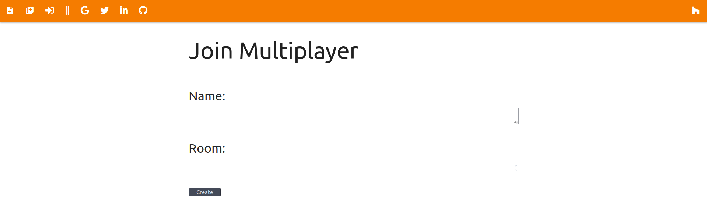

# Djanky BlackJack
Djanky BlackJack is a janky blackjack implementation in django. It is self-explanatory. 
This was my final project for the week-long TRACE sponsored django bootcamp.

* Janky things
  1. No use of sockets, but forced page reloads
  2. Too many variables, clunky models
  
* Other details
  * Uses materialize for styling
